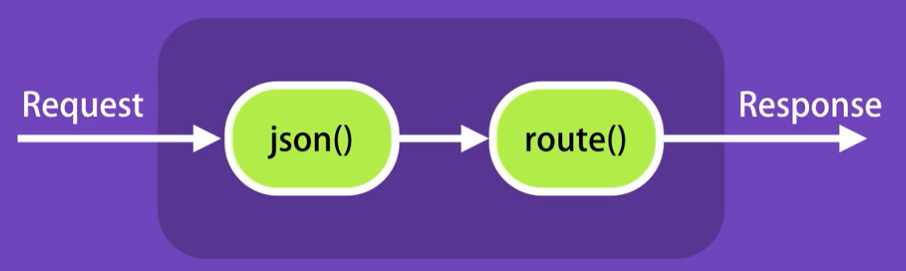

# JavaScript Course

NodeJS is an open-source & runtime environment for excuting Javascript code outside of the browser. NodeJS is mostly used for building a backend apps (API). It is very <b>superfast</b> and highly scalable (faster than java).

<b>Architecture of the NodeJS</b>

We are using JS engine to convert JS code into machine code for eg. Firefox using SpiderMonkey, Chrome using V8 engine. The node is an runtime environment using V8 engine. Node has different object such as `http.creatServer()`, `fs.readFile()` etc. wherease in browser we have document (`document.getElementById('')`) object.

Essentially, Node is a C++ program that embeds Chrome’s v8 engine, the fastest JS engine in the world.

<b>How Node Works</b>

- We use Node to build fast and scalable networking applications.

- It’s a perfect choice for building RESTful services.

- Node applications are asynchronous or non-blocking by default.That means when the application involves I/O operations (eg accessing the file system or the network), the thread doesn’t wait (or block) for the result of the operation. It is released to serve other clients. All other frameworks as Rail, NET.ASP are synchronous and therefore they need to use many threads to do same work.

- This architecture makes Node ideal for building I/O-intensive applications. You should avoid using Node for CPU-intensive applications, such as a video encoding service. Because while executing these operations, other clients have to wait for the single thread to finish its job and be ready to serve them.  

<b>Installing Node</b>

Let's see if you are already installed Node with running `node --version` in your terminal.

If not go to https://nodejs.org/en/ and download the NodeJs to your computer based on you OS.

<b>How to execute js file</b>

To execute node js code we need to run `node app.js` where we pass app.js as an argument. NodeJS is an environment built on C++ using V8 engine to run the app.

## Node Module System

<b>Global Object</b>

Global object for JS for browser is `window` where we can find all global mehtods such as `window.console.log()`, `window.setTimeout()` etc but in Node we do not have `window` object instead we have `global`.

<b>Modules</b>

Every file in a Node application is a module. Node automatically wraps the code in each file with an IIFE (Immediately-invoked Function Expression) to create scope. So, variables and functions defined in one file are only scoped to that file and not visible to other files unless explicitly exported.

```
// EXPORT Module

var testModule = { a: 1, b: 2 };
// ---------- ES5 ----------
module.exports = testModule;
// ---------- ES6 ----------
export default testModule;
// ---------- ES6 (child modules) ----------
export const a = 1;
export const b = 2;
```

```
// IMPORT Module

// ---------- ES5 ----------
var testModule = require(./testModule);
// ---------- ES6 ----------
import testModule from './testModule';
// ---------- ES6 (child modules) ----------
import { a, b } from './testModule';
```

<b>Built-in Modules in Node</b>

Node has several useful modules built in the node. You can see all modules in documentation of the Node. I am going to highlight some of them below:

- path > better to use this module when working with path
- os > is useful when working with operating system
- fs > is useful when working with file system
- events > it is a core module for Node js 
- http > for creating network in application such as backend service etc

<b>Node Core Recap</b>

- We don’t have the window object in Node. 
- The global object in Node is “global”. 
- Unlike browser applications, variables we define are not added to the “global” object.
- Every file in a Node application is a module. Node automatically wraps the code in each file with an IIFE (Immediately-invoked Function Expression) to create scope. So, variables and functions defined in one file are only scoped to that file and not visible to other files unless explicitly exported.
- To export a variable or function from a module, you need to add them to module.exports: `module.exports.sayHello = sayHello;`
- To load a module, use the require function. This function returns the module.exports object exported from the target module: `const logger = require(‘./logger’);` 
- Node has a few built-in modules that enable us to work with the file system, path objects, network, operating system, etc. 
- EventEmitter is one of the core classes in Node that allows us to raise (emit) and handle events. Several built-in classes in Node derive from EventEmitter.
- To create a class with the ability to raise events, we should extend EventEmitter: `class Logger extends EventEmitter { }`

## Node Package Manager (NPM)

NPM it is a command line tool as well as a registry of third party libraries that we can add to Node applicaitons.

[https://www.npmjs.com/](https://www.npmjs.com/)

<b>Package.json</b>

Package.json is a json file that includes some basic information about the application such as its name, version, authors, address of github repository, dependencies and so on! It is basically a bunch of metadata about the application.

To create package.json file run `npm init` or without answering questions you can run `npm init --yes` to skipt default questions.


<b>Installing a Node Package</b>

To instal a popular library underscore, run `npm i underscore` in your terminal.

<b>Semantic Versioning</b>

Also called SemVer. In package.json we have versions of different dependencies

```
  "dependencies": {
    "mongoose": "^6.3.4", 
    "underscore": "~1.13.3"
  }
```

- Major.Minor.Patch - where ^ (caret) represents that we are interested in any version from 6.x.x
- Where ~ (tidla) represents that we are interested in any version from 1.x.x
- If we want to the specific version we just remove the carot or tidla 

<b>Listing the Installed Packages</b>

If you are using ^ or ~ in version, you should list the dependicy version with npm because the version in package.json does not have to show the accurate version which is installed.

To list all dependecies with current installed version, we can run `npm list` or `npm list --depth=0` to see just the dependencies for your app. 


<b>Viewing Registry Info for a Package</b>

- `npm view mongoose dependencies` to see all version of depenecy which mongoose uses
- `npm view mongoose versions` to see all existing versions for mongoose

<b>Installing a Specific Version of a Package</b>

`npm i mongoose@2.4.2` to instal specific version of mongoose

<b>Updating Local Packages</b>

- `npm outdated` to see outdated dependecies
- `npm update` to update dependecies but only minor or patch. Not for Major upgrade of the version.

<b>DevDependencies</b>

- `npm i jshint --save-dev` to use this dependency only in dev environment and not in production env. 

<b>Uninstalling a Package</b>

- `npm un mongoose` or `npm uninstall mongoose` to uninstal mongoose. It is going to be removed from package.json as well as in node_modules

-To install/uninstall packages globally, use -g flag such as `npm -g outdated`.

## RESTful API's Using Express

REST stadns for <b>Re</b>presentation <b>State</b> <b>T</b>ransfer

Using Http protocols we can use CRUD operations:
- Create
- Read
- Update
- Delete

Http metods are:
- GET     > to get data
- POST    > to create data
- PUT     > to update
- DELETE  > to delete data

example with exposing customers collection:

- GET /api/customers        > to get all customers
- GET /api/customers/1      > to get the sepcific customer with id 1
- POST /api/customers       > to create a cusotmer
- PUT /api/customers/1      > to update the sepcific customer with id 1
- DELETE /api/customers/1   > to delete the sepcific customer with id 1

<b>Introducing Express</b>

Express is a framework for building a REST API. It supplies with a bunch of pre-build features.

<b>Nodemon</b>

In order to not restart server to update the changes we can globally instal nodemon (node monitor)
`npm i -g nodemon` and then run `nodemon index.js` instead of `node index.js`

<b>Environment Variables</b>

we use `process.env.{envVariable}` to get env variable.

<b>Route Parameters</b>

We use route parameters for essential or require values (2018) wheres we use query string parametrs (?sortBy=name) for anything which is optional

`localhost:3000/api/posts/2018?sortBy=name`

- `req.params` is an object of the required params
- `req.query` is an object of the query string params

<b>Middleware</b>

Middleware or middleware function is basically a function that takes a request object and either a response to the client or passes control to another middleware function.

Route handler is a middleware function `(req, res) => {res.send("Hello World!")}` This middleware terminates the request response cycle.

Another example is `app.use(express.json())`. This middleware is to read the request and if there is json object in the body of the request. It will parse the body of the request into a json object and then it will set the `req.body` property.

When we receive the request on the server, the request goes through below pipeline (Request Processing Pipeline). We have one or more middleware function in the pipeline.



<b>Custom Middleware</b>

Custom middleware function contains three parameters:

```
function(req, res, next) {
    console.log("Logic");
    next()
}
```

- `next()` call the next middleware function otherwise it will be stuck.

<b>Built-in Middleware</b>

We have several built-in middleware such as:

- `app.use(express.json())`
- `app.use(express.urlencoded({ extend: true }))`
- `app.use(express.static("public"))` to expose files in the public folder

<b>Third-party Middleware</b>

To see all avaliable [middlewares](https://expressjs.com/en/resources/middleware.html)

<b>Environments</b>

`process.env.NODE_ENV` to get a current environment but if it is not set we get `undefined`

or

`app.get('env')` to get a current environment but if it is not set we get `development` 

<b>Environments</b>

There many great configuration libraries for NodeJS but we will use `config`.

- `npm i config`

<b>Debuggin</b>

Instead of using `console.log()` it is better to use debugging package

- `npm i debug`

<b>Templating Engines</b>

In case we need to send back to client a html page we can use some of hte templating engines suchs pug, mustache etc.

- `npm i pug`
- `app.set('view enigne', 'pug');`
- `app.set('views', './views); // It is default so we do not have to mention this`

In root of the app we create folder views with a file index.pug


